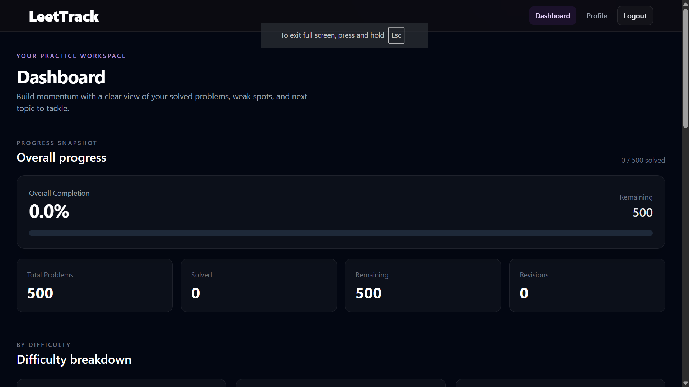
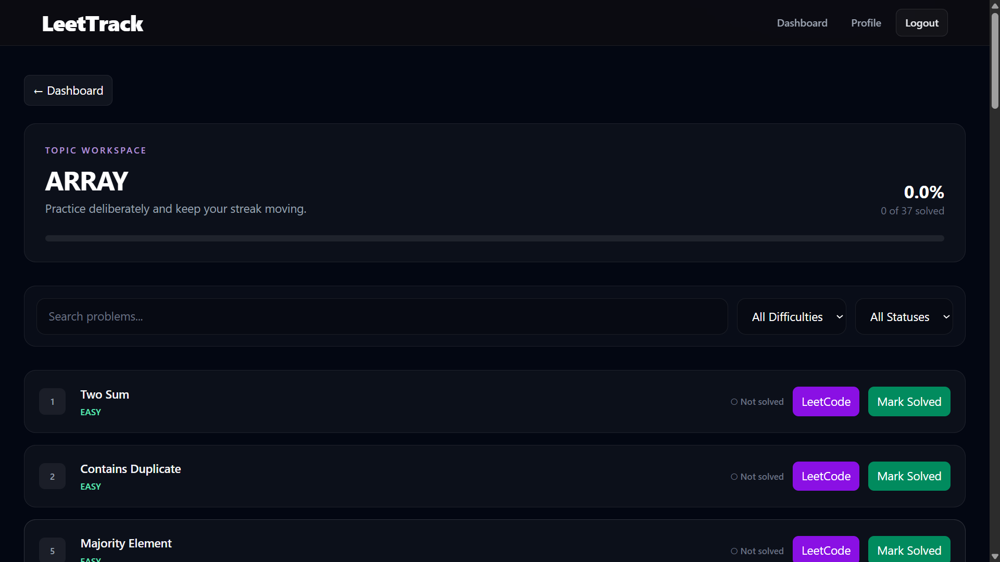
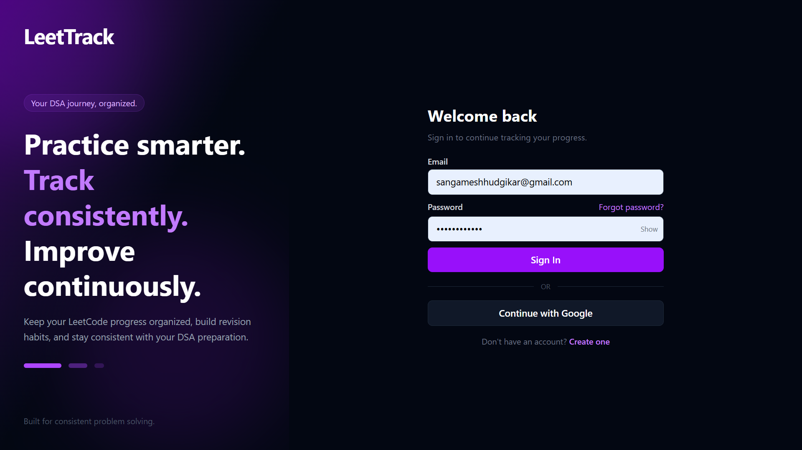
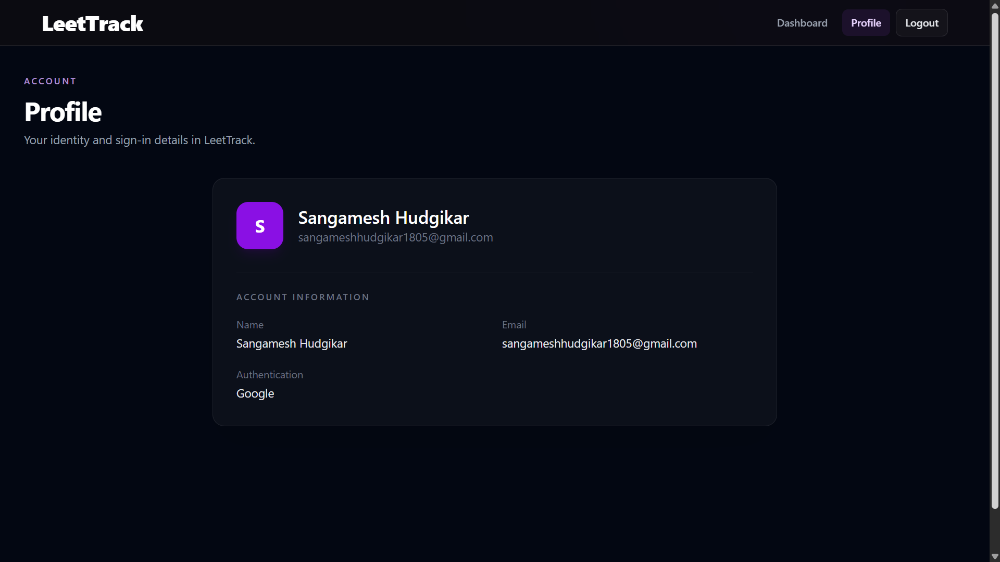

# LeetTrack

LeetTrack is a full-stack web application for tracking and improving LeetCode problem-solving progress.

It provides a curated collection of 500 high-value LeetCode problems, personalized progress tracking, revision history, statistics, filtering, authentication, and a modern React-based interface.

## 🚀 Live Demo

**Frontend:** https://leettrack.up.railway.app

**Backend API:** https://backend-production-5560.up.railway.app

---

## 📸 Screenshots

### Dashboard



### Problem Tracking



### Login



### Profile



---

## ✨ Features

### 🔐 Authentication

- User registration and login
- BCrypt password hashing
- JWT-based authentication
- Google OAuth 2.0 login
- Logout functionality
- Forgot password flow
- Password reset through email
- User-specific authentication and data

### 📚 Problem Tracking

- Curated collection of 500 important LeetCode problems
- Problems organized by DSA category
- Difficulty classification:
  - Easy
  - Medium
  - Hard
- Direct links to LeetCode problems
- Mark problems as solved
- Track solving date
- Undo solved status

### 🔄 Revision System

- Add revisions for solved problems
- Track revision count
- Store revision timestamps
- View complete revision history
- Track total revisions across the account

### 📊 Progress & Statistics

- Total problems
- Solved problems
- Remaining problems
- Overall completion percentage
- Easy / Medium / Hard progress
- Total revisions
- Category-based problem progress

### 🔎 Problem Discovery

- Search problems by title
- Filter by difficulty
- Filter by category
- Browse problems by topic

### 👤 User Profile

- View user information
- Authentication provider information
- Personalized progress data

### 🎨 Modern UI

- Responsive React interface
- Dark-themed design
- Dashboard-based navigation
- Topic-based problem pages
- Authentication pages
- Profile page
- Mobile-friendly layout

---

## 🛠️ Tech Stack

### Frontend

- React
- Vite
- Tailwind CSS
- React Router
- Axios

### Backend

- Java
- Spring Boot
- Spring Security
- Spring Data JPA
- Hibernate
- JWT
- OAuth 2.0 / Google OAuth
- JavaMail

### Database

- MySQL

### Deployment

- Railway
- GitHub

---

## 🏗️ Architecture

```text
                         ┌──────────────────────┐
                         │      User Browser    │
                         └──────────┬───────────┘
                                    │
                                    ▼
                         ┌──────────────────────┐
                         │   React Frontend     │
                         │   Vite + Tailwind    │
                         └──────────┬───────────┘
                                    │
                                 REST API
                                    │
                                    ▼
                         ┌──────────────────────┐
                         │   Spring Boot API    │
                         │                      │
                         │  JWT Authentication  │
                         │  Google OAuth        │
                         │  Progress Tracking   │
                         │  Revision History    │
                         └──────────┬───────────┘
                                    │
                                    ▼
                         ┌──────────────────────┐
                         │      MySQL DB        │
                         │                      │
                         │ Users                │
                         │ Problems             │
                         │ User Progress        │
                         │ Revision History     │
                         │ Password Reset       │
                         └──────────────────────┘

```
---

## 📁 Project Structure

```text
LeetTrack/
│
├── backend/
│   ├── src/
│   │   └── main/
│   │       ├── java/
│   │       │   └── com/
│   │       │       └── leettrack/
│   │       │           └── backend/
│   │       │               ├── config/
│   │       │               ├── controller/
│   │       │               ├── dto/
│   │       │               ├── entity/
│   │       │               ├── repository/
│   │       │               ├── security/
│   │       │               └── service/
│   │       │
│   │       └── resources/
│   │           └── application.properties
│   │
│   └── pom.xml
│
├── frontend/
│   ├── src/
│   │   ├── components/
│   │   ├── context/
│   │   ├── pages/
│   │   ├── services/
│   │   ├── App.jsx
│   │   └── main.jsx
│   │
│   ├── package.json
│   └── vite.config.js
│
└── README.md
```

---

## 🔐 Authentication Flow

### Email / Password

```text
User
 ↓
Register
 ↓
BCrypt password hashing
 ↓
MySQL
 ↓
Login
 ↓
JWT generated
 ↓
JWT stored by frontend
 ↓
Authenticated API requests
```

### Google OAuth

```text
User
 ↓
Continue with Google
 ↓
Google OAuth
 ↓
Spring Security OAuth2
 ↓
User created/found
 ↓
JWT generated
 ↓
Frontend OAuth success page
 ↓
Dashboard
```

---

## 📈 Progress Tracking

Each user has personalized progress for the problem set.

A problem can move through a workflow such as:

```text
Unsolved
   ↓
Solved
   ↓
Revision 1
   ↓
Revision 2
   ↓
Revision 3
   ↓
...
```

The application maintains revision history independently for each user.

---

## 🔎 Problem Filtering

Problems can be searched and filtered using:

* Problem title
* Difficulty
* DSA category

Example:

```text
Search: binary
Difficulty: Medium
Category: Binary Search
```

The backend provides APIs for retrieving and filtering the problem dataset.

---

## ⚙️ Local Development

### Prerequisites

Make sure you have:

* Java 17+
* Maven
* Node.js
* npm
* MySQL
* Git

### 1. Clone the repository

```bash
git clone https://github.com/Sangamesh1805/LeetTrack.git
cd LeetTrack
```

### 2. Configure MySQL

Create a MySQL database:

```sql
CREATE DATABASE leettrack;
```

Configure the backend environment variables:

```env
DB_HOST=localhost
DB_PORT=3306
DB_NAME=leettrack
DB_USERNAME=your_mysql_username
DB_PASSWORD=your_mysql_password

JWT_SECRET=your_jwt_secret

GOOGLE_CLIENT_ID=your_google_client_id
GOOGLE_CLIENT_SECRET=your_google_client_secret

MAIL_USERNAME=your_email
MAIL_PASSWORD=your_email_password

FRONTEND_URL=http://localhost:5173
```

> Never commit passwords, API keys, OAuth secrets, or other sensitive credentials to GitHub.

### 3. Start the backend

```bash
cd backend
mvn spring-boot:run
```

Backend:

```text
http://localhost:8080
```

### 4. Start the frontend

Open another terminal:

```bash
cd frontend
npm install
npm run dev
```

Frontend:

```text
http://localhost:5173
```

---

## 🌐 Environment Variables

### Backend

```text
DB_HOST
DB_PORT
DB_NAME
DB_USERNAME
DB_PASSWORD

JWT_SECRET

GOOGLE_CLIENT_ID
GOOGLE_CLIENT_SECRET

MAIL_USERNAME
MAIL_PASSWORD

FRONTEND_URL
```

### Frontend

```text
VITE_API_URL
VITE_BACKEND_URL
```

Example local configuration:

```env
VITE_API_URL=http://localhost:8080/api
VITE_BACKEND_URL=http://localhost:8080
```

Production environment variables should be configured through the deployment platform and should not be committed to the repository.

---

## 🚀 Deployment

LeetTrack is deployed using Railway.

The production setup consists of three services:

```text
Railway Project
│
├── MySQL
│
├── Backend
│   └── Spring Boot
│
└── Frontend
    └── React + Vite
```

### Backend

The Spring Boot backend is deployed from:

```text
/backend
```

It connects to the Railway MySQL service using environment variables.

### Frontend

The React frontend is deployed from:

```text
/frontend
```

It communicates with the production backend through:

```text
VITE_API_URL
```

---

## 🔒 Security

The application uses:

* BCrypt for password hashing
* JWT for stateless authentication
* Spring Security
* Google OAuth 2.0
* Environment variables for secrets
* Protected API endpoints
* User-specific progress and revision data
* CORS configuration for authorized frontend origins

Sensitive configuration values are excluded from version control.

---

## 🎯 Project Goals

LeetTrack was built to solve a common problem with DSA preparation:

> Solving problems is only one part of learning. Tracking progress and revisiting problems consistently is equally important.

The goal of LeetTrack is to provide a structured system where developers can:

1. Follow a curated problem set
2. Track solved problems
3. Measure progress
4. Revisit problems through revisions
5. Analyze difficulty-based progress
6. Maintain a consistent DSA preparation workflow

---

## 🔮 Future Improvements

Potential future improvements include:

* Daily solving streaks
* Advanced analytics
* Revision reminders
* Spaced repetition scheduling
* Custom problem lists
* Notes for individual problems
* Difficulty-based recommendations
* More detailed progress charts
* Admin dashboard
* Automated problem data updates

---

## 👨‍💻 Author

**Sangamesh**

Information Science Engineering Student interested in:

* Software Development
* Java
* Backend Development
* Data Structures & Algorithms

---

## ⭐ Feedback

If you find the project useful or have suggestions for improvement, feel free to open an issue or contribute to the project.

---

**Built with Java, Spring Boot, React, MySQL, and a lot of LeetCode. 🚀**
